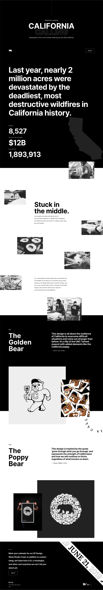

# California Calling Projekt

## Überblick

**California Calling** ist eine Landingpage, die den Gemeinden gewidmet ist, die von den verheerenden Waldbränden im Jahr 2018 in Kalifornien betroffen waren.

Diese Seite wurde gemeinsam von [André](https://github.com/cadeteandre) und [Minyeong](https://github.com/manonsfoto) gestaltet.

[Hier kannst du die Live-Demo ansehen](https://manonsfoto.github.io/Tag12_Project_California_Calling/)

## Technologien

- **HTML5**: Zur Erstellung der Grundstruktur der Seite.
- **CSS3**: Für das Styling, Animationen und Transformationen.
- **CSS-Animationen und -Transformationen**: Um Bewegung und Interaktivität auf die Seite zu bringen.

## Projektvorschau

